<p align="center">
  
</p>

<h1 align="center">KAM PDFs</h1>

<p align="center"><b>A free PDF editor and document scanner that just works. No account, no subscription, no upload. Runs on your computer, even offline.</b></p>

<p align="center">
  <a href="#new-in-20">New in 2.0</a> ·
  <a href="#download">Download</a> ·
  <a href="#what-it-does">Features</a> ·
  <a href="#scan-with-your-phone">Scanner</a> ·
  <a href="#screenshots">Screenshots</a> ·
  <a href="#how-it-works">How it works</a>
</p>


## Why this exists

You know the routine. You need to sign one form or fix one line in a PDF. You find an "editor", spend twenty minutes doing the work, hit Save, and only then does the paywall appear. Pay up, or lose everything you just did. Your document is held hostage, and half the time it has been uploaded to a server you have never heard of.

Scanner apps are the same story: point your phone at a letter and there is a subscription screen before the PDF. Straightening a photo and cleaning it up is not hard, and it is certainly not worth a monthly fee.

That is a scam dressed up as software, and I got sick of it. So I built KAM PDFs.

**KAM PDFs is free. Not free for seven days, not free with a watermark, not free until you click Save. Free.** There is no account, no upgrade button, no trial, and no upload. Your files never leave your computer. It works with the internet unplugged.

It stays that way. The code is MIT licensed, so it is yours to use, copy, and share with anyone. If someone ever tries to charge you for KAM PDFs, they are not me.

## New in 2.0

- **Edit a PDF's own text in its own font.** Double-click a line and retype it right where it is. The letters are the document's own, so the line looks exactly as it did, just with your words. Deleting text removes it from the file instead of covering it up.
- **One long scroll of pages**, like any PDF reader, and big documents stay light.
- **Password-protected PDFs open.** Type the password once, and it never leaves your computer.
- **Links and bookmarks work**, and you can add your own bookmarks.
- **Phones and tablets.** The page gets the screen, the panels slide in when you want them, and you can pinch to zoom.

The [release notes](../../releases/latest) have the full list.

## Download

### Windows (recommended)

1. Download the latest zip from the [Releases page](../../releases/latest) and unzip it anywhere (for example `Documents\KAM PDFs`).
2. Double-click **`Install KAM PDFs.bat`**.
3. That's it. A **KAM PDFs** icon appears on your Desktop and in the Start Menu. It opens the editor in its own window, like any other app.

The installer only creates two shortcuts. To remove them, run `Remove shortcuts.bat`. Nothing else is written to your system.

If you have also installed KAM PDFs from the website (see below), the installer notices and points the shortcut at that instead, so you get the sharp taskbar icon and only one Desktop icon. Installed the app after running the installer? Just run it again.

> If Windows shows "Windows protected your PC", click **More info → Run anyway**. The script is a few lines of PowerShell you can read in `setup/install.ps1`.

### Install from the website (best icon, works offline too)

Open **https://ari-joon.github.io/KAM-PDFs/** in Chrome or Edge and click **⬇ Install app** in the top right (or the install icon in the address bar). You get a proper app with its own window, a sharp taskbar icon, and a Start Menu entry. The whole app is cached on your computer, so it keeps working with no internet.

### Mac, Linux, or no install

Unzip and open `index.html` in Chrome, Edge, Firefox, or Safari. Everything works the same. You can also use it straight from the browser at the link above.

## What it does

**Easy to find your way around**
- Opens to a simple question, *what would you like to do?*, with four answers: edit or sign a PDF, combine PDFs, turn photos into a PDF, or scan a document. Nothing else is on screen until there is a document to work on
- Press **Ctrl+K** and type what you want, like *watermark*, *rotate* or *sign*, and press Enter. Every command is in there, so you never have to know where something lives
- Rarely used actions sit in the **File** menu; the four shapes share one **Shapes** button; zoom and page controls live in a status bar under the page
- The Document tab folds into sections (Save & export, Stamp every page, Scanned pages, Text & spelling, Document details, Settings) and remembers which ones you keep open
- A dot on **Save PDF** and in the window title tells you there are unsaved changes. Opening another file, starting a new one or restoring a session asks **Save / Don't save / Cancel** first, so work is never thrown away without asking

**Edit the text that's already there**
- Double-click any line of the PDF's own text and retype it in place. The letters come from the font inside the PDF, at the same size, colour and spacing, so the line looks exactly as it did, only with your words. What you see while typing is drawn from the same layout that is written into the file, so the saved PDF matches the screen
- If the document's font doesn't have a letter you type (PDFs often carry only the letters they use), it comes from a matching font that ships with KAM PDFs: Carlito for Calibri, Caladea for Cambria, and Liberation Sans, Serif and Mono for Arial and Helvetica, Times, and Courier. Each has the same letter widths as the font it stands in for, so the line still lines up
- The line keeps its alignment as you type: left-aligned text grows to the right, right-aligned and centred lines stay that way, and justified lines keep both margins
- Click a line and press Delete, and the words are taken out of the page itself. Nothing is painted over them, so table borders, shading and anything else nearby stay exactly as they were
- Works on text in any language the PDF's font can write, including accents, Polish, Greek and Russian
- A few lines can't be rewritten like this: right-to-left scripts such as Arabic and Hebrew, and text drawn in unusual ways. Those are edited the older way, by covering the line and typing over it, and deleting one redacts it. Those deleted areas are hatched in red on screen so you can see them (the hatch is not saved), and clicking one selects the deletion, so Delete there puts the words back
- Drag across text to select it and Ctrl+C to copy
- Find (Ctrl+F) searches the whole document, including your edits, and steps through matches

**Pages**
- All pages in one long scroll, like any PDF reader. Only the pages near the window are drawn, so a 300-page file scrolls as lightly as a 3-page one
- Ctrl + mouse wheel zooms around the pointer; Page Up/Down, Home/End and the arrow keys move through the document
- Rotate, delete, duplicate, and insert blank pages; undo and redo all of it
- Reorder pages by dragging thumbnails
- Merge other PDFs into the current one, fill-in fields included
- Turn images (JPG, PNG, and so on) into PDF pages
- Extract a page range into a separate PDF (split)

**Links and bookmarks**
- Links in the PDF work: hover one to see where it goes, and Ctrl+click to follow it. A web link opens in your browser; a link to another page scrolls there. On a touch screen, tap the link and then the button that appears
- The **Bookmarks** list beside the pages shows the document's outline, sections inside chapters. Click one to go there
- **Bookmark this page** adds one where you are, named after the first words in view. Double-click to rename it, or remove it. Bookmarks are saved in the PDF, so every reader shows them

**Password-protected PDFs**
- A PDF locked with a password asks for it once and opens (AES-256 and the older kinds). The password is only used on your computer and is not kept
- A PDF that is only protected against changes opens for editing straight away
- The copy you save opens without a password

**Layers**
- Every mark you add is listed in the Layers tab, newest first: select, hide, reorder or delete any of them
- Drag a row up or down to change what sits on top, or use the arrows
- Text edits and deletions are listed too, quoting the words before and after, so you can find and undo one later
- Marks pile up quickly when you cover and retype things, and the list is how you reach the one underneath
- Double-click anywhere, including inside a whiteout, to type there

**Redact and scan**
- Redact permanently removes what is underneath: that page is rebuilt from a picture of itself, so the hidden words are not in the saved file at all
- OCR reads the words off a scanned page and adds them to the saved PDF as an invisible layer, so the scan becomes searchable. It runs on your computer, like everything else

**Annotate**
- Text in Helvetica, Times, Courier, Carlito (a free twin of Calibri) or Caladea (Cambria's twin), bold, any size and colour
- Type in any language: letters outside the basic Western set, such as Polish, Greek or Russian, are saved with a bundled font so they come out right in the file
- Freehand pen, lines, arrows, rectangles, ellipses
- Highlighter and whiteout
- Insert images and hand-drawn signatures. A picture is kept once however often you copy it, and big photos are kept at a size that still prints a full page sharply, so undo and the working copy stay light
- Fixed-width text boxes that wrap automatically, or free-floating text
- Move, resize, recolour, and delete anything you added, with undo and redo
- Copy, paste, duplicate, and nudge annotations with the keyboard; paste images or text from the clipboard
- Hold Shift to keep a rectangle or ellipse square, or snap a line or arrow to 45 degrees
- Signatures you draw are kept, so you can reuse one with a click instead of drawing it again
- Spell checking on text you add: misspellings are underlined, with suggested corrections and your own dictionary for names and jargon

**Phones and tablets**
- On a phone the page gets the whole screen. The pages list and bookmarks slide in from the left and the Document panel from the right, whenever you want them
- One finger scrolls, a tap selects, a double tap edits, and two fingers pinch-zoom the document rather than the whole app
- When the keyboard opens, the line you are typing stays in view
- On a tablet the pages list stays beside the page and the Document panel waits in a drawer

**Scan**
- Use your phone as a scanner: photograph pages, they arrive on the computer straightened and cleaned up
- Auto-detects the page edges, with draggable corners to fix it when it guesses wrong
- Colour, grey, or black-and-white clean-up, rotation
- Works from the computer's webcam or from photos you already have
- The phone page also saves and shares PDFs on its own, no computer needed, and keeps its pages if the page reloads. A page counts as sent only once the computer confirms it, and never arrives twice

**Document**
- Fill in form fields (text, checkboxes, radio buttons, dropdowns), optionally flatten them
- Watermark and page numbers on every page
- Edit title, author, subject, and keywords
- Extract the text of a page
- Export a page as a PNG
- Print
- Light and dark mode (the sun / moon button, remembered between sessions)
- A working copy is kept on your computer as you go, so a crash or a closed window does not cost you the afternoon. Reopen the app and it offers your last session back. Nothing is uploaded, and Forget removes it

**The window is yours to arrange**
- Drag the divider on either side of the page to resize the Pages and Document panels; drag one well past its minimum and the panel folds away, so the page gets the whole window
- Double-click a divider to put it back, or use the arrow keys once it has focus, so it works without a mouse
- Drag the dotted grip on the tool row to move the tools below the page instead of above it
- Whatever you set is remembered on this computer. **Reset layout** in the Document tab puts it all back

**Staying up to date**
- The circular arrow at the top right checks for a newer version whenever you click it. KAM PDFs also checks by itself once, a few seconds after it opens, and never while it stays open, so it is not going back to the network all day. Reopened within six hours of a check, it does not ask at all. It never sends anything about you or your file
- When there is one, the arrow becomes a gold **Update to x.y.z** button and a green bar under the tools says what changed
- **Update now** in that bar does it there and then: the app fetches the new version and restarts itself. Anything open is kept in the working copy first, so you don't lose it
- A copy you unzipped into a folder can't rewrite its own files, so the button downloads the new zip for you instead and says exactly where to unzip it
- **Not now** hides the bar until there is a version newer still. The gold button stays, so the update is one click away whenever you want it

## Screenshots

Every screenshot is the real app working on one sample document: a made-up film club review sheet for *The SpongeBob SquarePants Movie*, generated for these pictures and edited with the actual tools.

**Welcome screen.** It asks what you want to do, and shows nothing else until there is a document to work on.


**Find any command.** Press Ctrl+K and type. You never need to know where something lives.

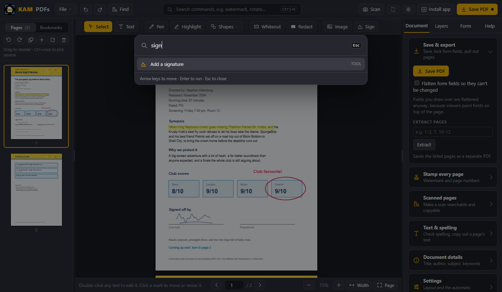

**Editing existing text.** Double-click a line already in the PDF and retype it where it is. Here the running time is getting a popcorn break added: the new words are in the line's own font, size and colour, drawn exactly as they will be saved.

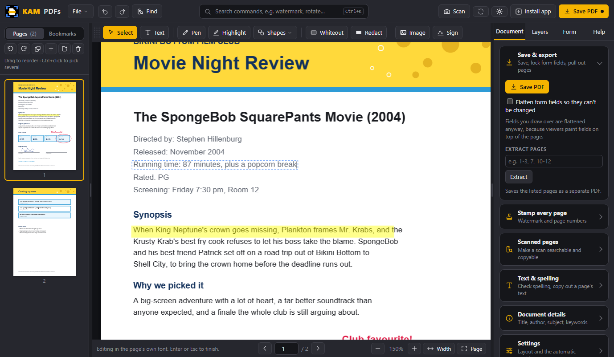

**Find.** Ctrl+F searches every page; Enter steps through the matches. Here, every SpongeBob on the sheet.

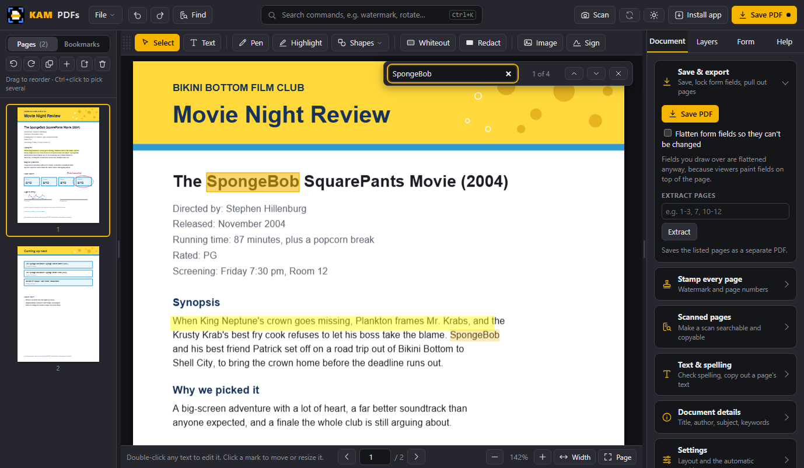

**Bookmarks, links, and one long scroll.** The Bookmarks list takes you to any part of the document, and you can add your own. Pages sit one under another, and hovering a link says where it goes.

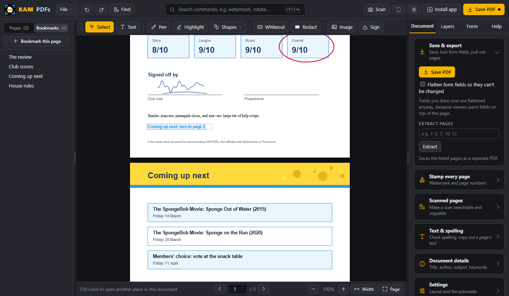

**Pen and colours.** Freehand drawing with any colour and width.

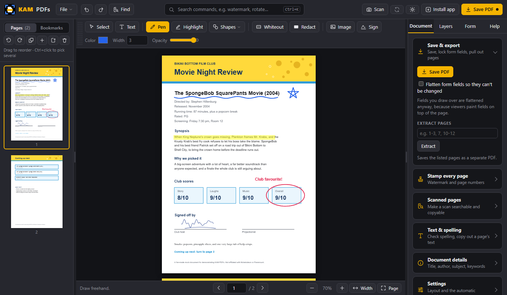

**Signatures.** Draw once, place anywhere, resize. It is remembered, so next time it is one click.

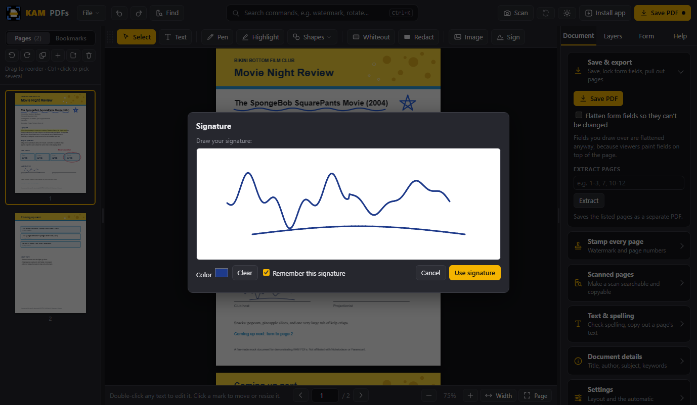

**Password-protected PDFs.** Type the password once. It is only used on your computer, and is not kept.

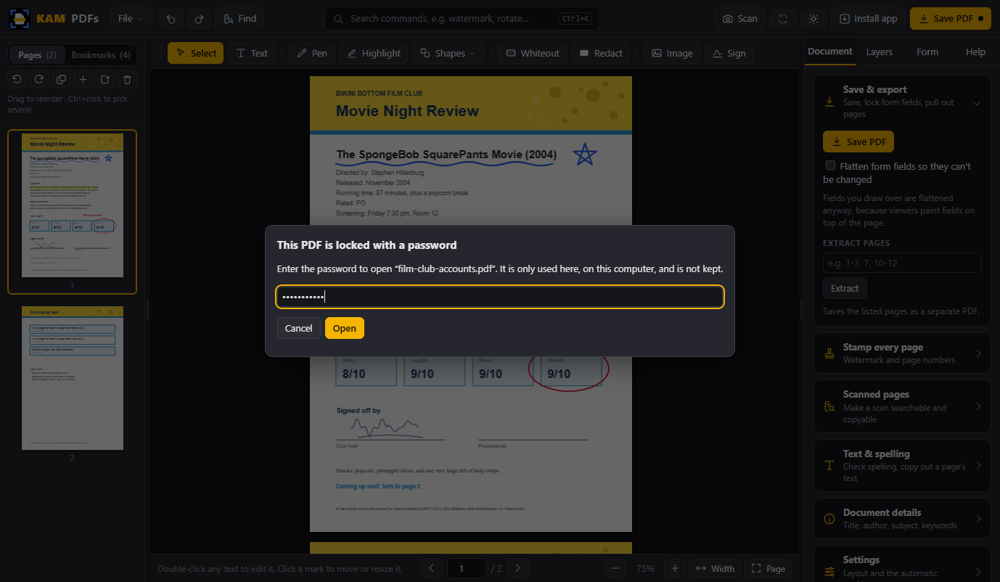

**On a phone.** The page gets the screen; the pages and bookmarks slide in from the side.

<p>
  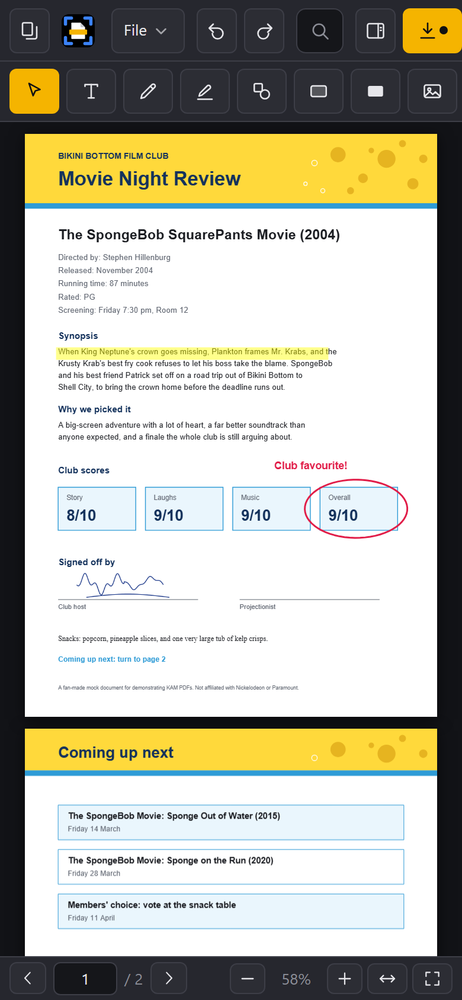
  &nbsp;
  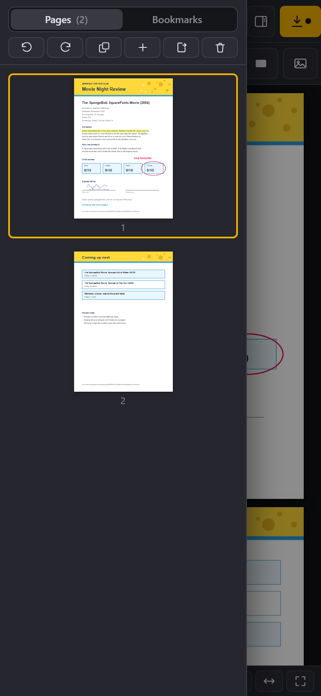
</p>

**Scanning.** The Scan dialog on the computer, then a photo of the printed sheet on a table, straightened and turned into a clean black-and-white page.


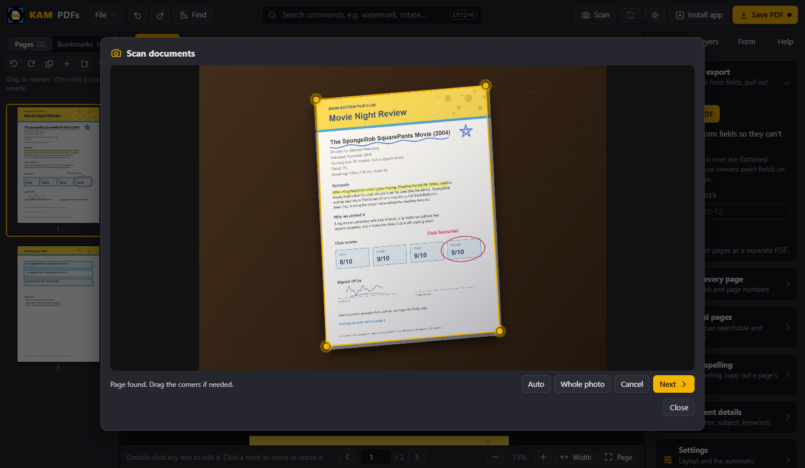


**Layers, and a window arranged to suit.** Everything you have changed on the page is listed newest first, the text edit included: select, hide, drag to restack, or delete any of it. The dividers either side of the page can be dragged to any width; here the Document panel is wide enough to read every row.

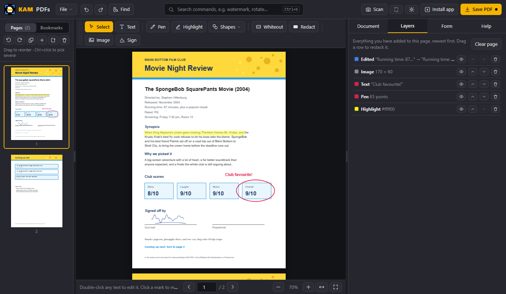

**Light mode.** One click on the sun button, remembered between sessions.


## Scan with your phone

1. On the computer, click **📷 Scan**. A QR code and a 6-character code appear.
2. On your phone, point the camera at the QR code (or open the scanner page and type the code).
3. Tap **Take photo**, photograph a page, drag the corners if needed, pick Colour / Grey / B&W, tap **Add page**. Repeat for more pages.
4. Tap **Send to computer**. The pages appear in KAM PDFs as new pages. Annotate, sign, save.

The phone and computer talk to each other **directly** over an encrypted WebRTC connection. A small public relay (the PeerJS broker) is used only to introduce the two devices by that code; it never sees your pages. Both devices need internet for that first handshake, then the pages flow device to device.

No computer nearby? The phone page works on its own: scan, then **Save PDF** or **Share PDF**.

Phone scanner page: https://ari-joon.github.io/KAM-PDFs/scan.html

## Keyboard shortcuts

| Key | Action |
|---|---|
| `V` `T` `P` `H` | Select, Text, Pen, Highlight |
| `R` `E` `L` `A` `W` | Rectangle, Ellipse, Line, Arrow, Whiteout |
| `Del` | Delete the selected annotation |
| `Ctrl+Z` / `Ctrl+Y` | Undo / redo |
| `Ctrl+C` `Ctrl+V` `Ctrl+D` | Copy, paste, duplicate the selected annotation |
| Arrow keys | Nudge the selected annotation (Shift for 10x) |
| `Ctrl+K` | Find any command by typing its name |
| `Ctrl+F` | Find in document (Enter / Shift+Enter to step) |
| `X` | Redact tool |
| Double-click | Edit the text under the cursor, or type where there is none |
| `Enter` / `Esc` | Finish editing a line of the PDF's text |
| `Ctrl` + click | Follow a link in the PDF |
| `Shift` while drawing | Square rectangles and circles; 45 degree lines and arrows |
| `Ctrl+S` / `Ctrl+P` | Save PDF / print |
| `←` `→` `PgUp` `PgDn` | Previous / next page (nothing selected) |
| `Home` `End` | First / last page |
| `Ctrl` + mouse wheel | Zoom around the pointer |
| Two fingers | Pinch to zoom (phones and tablets) |

## How it works

KAM PDFs is plain HTML, CSS, and JavaScript. Rendering uses [pdf.js](https://mozilla.github.io/pdf.js/) (Mozilla), editing uses [pdf-lib](https://pdf-lib.js.org/), and fonts are read with [fontkit](https://github.com/Hopding/fontkit). All three are bundled in the `lib` folder, which is why it runs offline.

Annotations are kept on a layer over the page while you work and are drawn into the PDF itself when you save, so the result opens correctly in any PDF viewer.

Editing the PDF's own text is KAM PDFs' own code (`content.js`). It reads the page's drawing instructions the way a PDF viewer does, checks every letter it finds against what pdf.js draws, and groups the letters into lines. When you retype a line, it rewrites only the instructions for the letters that changed, using the font inside the PDF, and moves the rest of the line the way the line is aligned. Everything else on the page is left as it was, and the tests check that not one pixel outside the edited lines changes. The live preview is drawn from that same layout, which is why the saved file matches the screen.

```
index.html              layout and styles
core.js                 loading, rendering, navigation, undo, theme, the password prompt
viewer.js               the pages in one scrolling column, zoom, pinch, drawing only what is near
annot.js                annotation tools and editing
ops.js                  page operations, forms, metadata, export
content.js              reads a page's text as it is drawn, and rewrites a line in its own font
fonts.js                the PDF's own fonts, and the bundled fonts that stand in for missing letters
textedit.js             the in-place line editor (the caret, selection and keyboard)
fonts/                  Liberation, Carlito and Caladea (loaded when a letter needs them)
crypt.js                opening password-protected PDFs (RC4, AES-128, AES-256)
links.js                links in the PDF, and the Bookmarks list
lib/                    pdf.js, pdf-lib, fontkit, peerjs, qrcode (all bundled)
lib/ocr/                Tesseract and its English data (loaded on first use)
pdftext.js              index of the PDF's own text: positions, lines, search
pdftext-ui.js           picking, selecting and deleting text, and the Find bar
ocr.js                  reading text off a scan (Tesseract, bundled)
ocr-ui.js               the OCR buttons and the invisible text layer
layers.js               the Layers panel
autosave.js             the working copy kept in this browser's storage
panels.js               dividers you can drag, the tool row's position, drawers on small screens
ux.js                   what is on screen when: the welcome screen, menus, sections, the unsaved dot
palette.js              Ctrl+K: find any command by typing its name
boot.js                 start-up (kept out of the page, so no inline script is ever allowed)
spell.js                dictionary loading, checking and suggestions
spell-ui.js             underlines and the spelling review dialog
dict/en.js              bundled English word list (loaded on first use)
scan.html               phone scanner page
scan-page.js            the phone page: pages kept through a reload, sent once each
scan-core.js            edge detection, perspective correction, clean-up
scan-ui.js              corner editor widget (phone and desktop)
scan-desktop.js         Scan dialog, receives pages from the phone
sw.js                   service worker: offline cache, installable app
version.json            the version this site is serving, which is how installed copies
                        learn that a newer one exists
logo-mark.svg           the logo with the wordmark dropped, for small sizes
setup/build-icons.js    redraws every icon and the .ico from the two SVGs
setup/build-assets.js   packs the fonts and the dictionary as scripts
setup/build-release.js  checks every file is in place and builds the Windows zip
setup/install.ps1       creates the Desktop and Start Menu shortcuts
Install KAM PDFs.bat    double-click installer (Windows)
tests/run.js            the test suite: node tests/run.js
```

## Limits

- Text is edited a line at a time. A line doesn't wrap onto the next one as it grows, so a much longer sentence runs on past the margin: shorten it, or split it across lines yourself.
- A few lines are edited the older way, by covering them and typing over in one of the built-in fonts: right-to-left scripts such as Arabic and Hebrew, and text drawn in unusual ways (vertical, mirrored, or invisible like the text layer of a scan). Covering hides the old words rather than removing them; pressing Delete on such a line does remove them, with a redaction.
- A scanned page is a picture, so there is no text on it to retype. Cover and type over it, or run OCR to make it searchable.
- Whiteout **hides** what is under it, it does not delete it: the words can still be extracted from the file. Use **Redact** when something must actually be gone. The test suite asserts both behaviours so neither can drift.
- A redacted page is rebuilt as an image, so it looks slightly softer at high zoom and the file gets bigger. Every word that was not redacted is put back as invisible text, so the page stays searchable. Other pages are untouched.
- The copy you save of a password-protected PDF has no password. KAM PDFs can't add one yet.
- Covering a form field flattens the form when you save, because PDF viewers always paint fields on top of the page. Fields you don't draw over stay editable.

## Tests

```bash
node tests/run.js
```

Sixty-nine tests. Text editing is checked on documents made every way they are made in real
life: by pdf-lib, by Chrome's own "Save as PDF" inside the test, and by Microsoft Word, with
kerning, letter spacing, tabs, bullets, justified lines, form objects, turned pages, and
Polish, Greek, Russian, Hebrew and Arabic text. Each edit is checked three ways: not one pixel
may change outside the edited lines, the screen must match the saved file, and a second PDF
engine (PDFium, the one in Chrome and Edge) must read the new words and none of the old.

The rest cover page operations, annotation fidelity, form fields, selection, find, spell
checking, redaction, OCR, layers, the working copy, undo, memory, password-protected PDFs,
links and bookmarks, phones and tablets, the scanner, the movable panels, the icon set, the
welcome screen, the menus, the command search and the update check. Needs Node 18+ and
Chrome; nothing to install. See [tests/README.md](tests/README.md) for what each one checks
and why several of them deliberately use a second rendering engine.

## Licence

MIT. See [LICENSE](LICENSE). The bundled libraries, fonts and word list keep their own licences, listed in [THIRD-PARTY-NOTICES.md](THIRD-PARTY-NOTICES.md).
