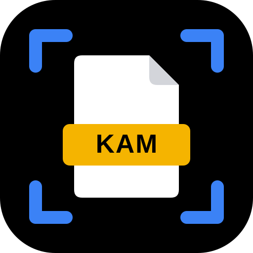
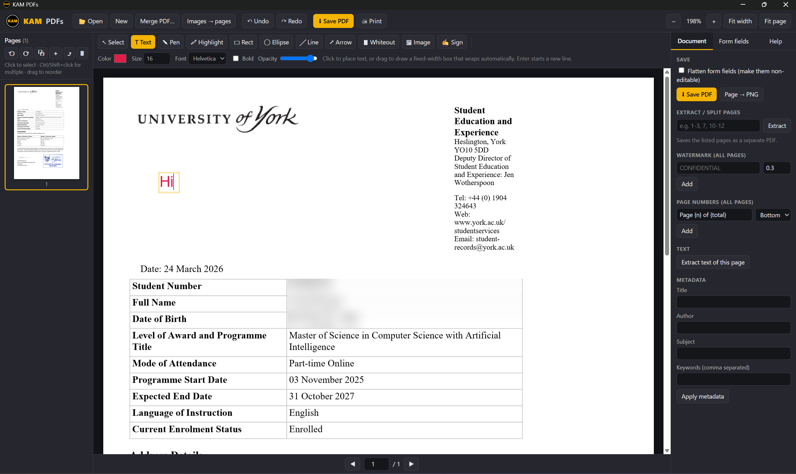
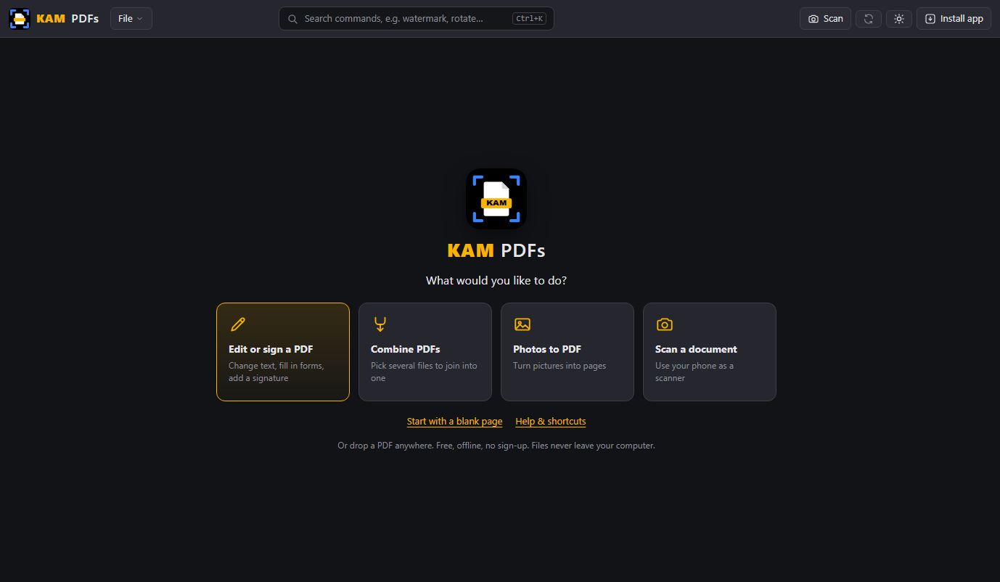
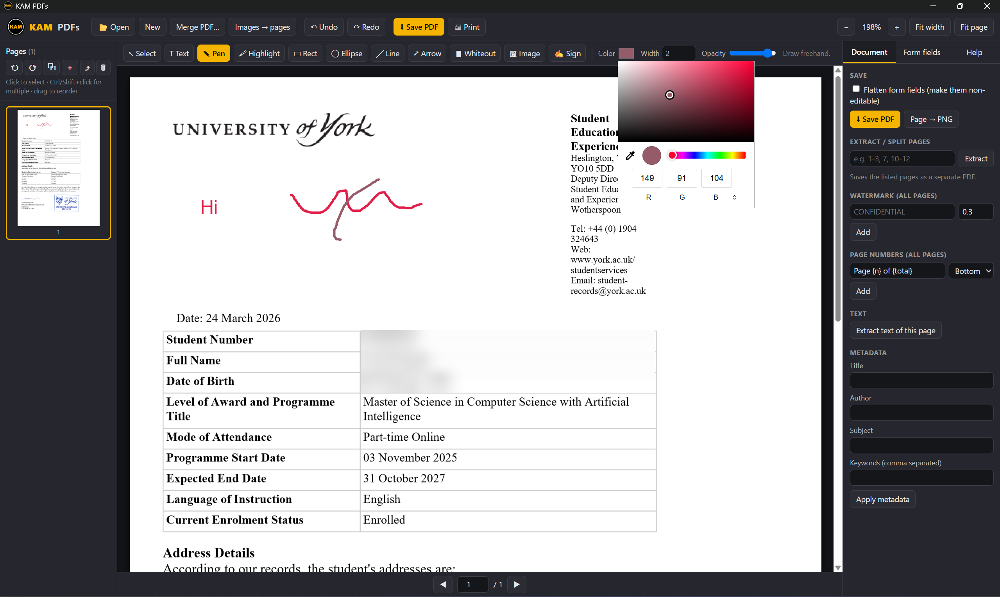
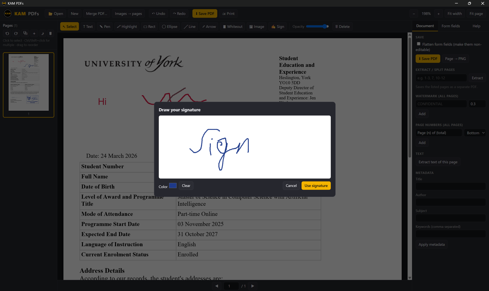
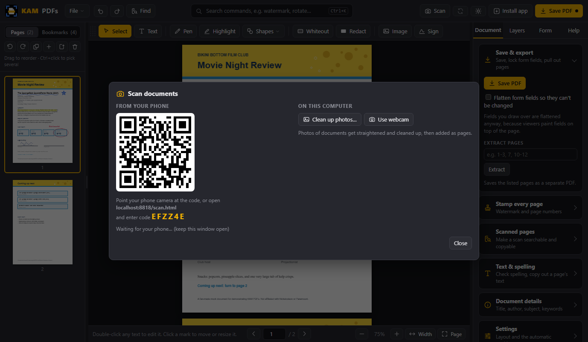
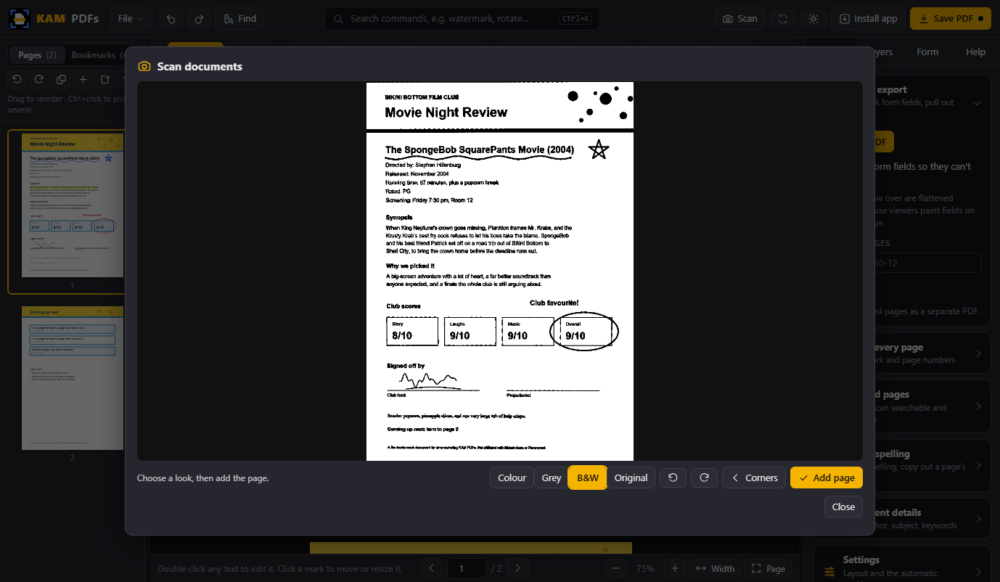
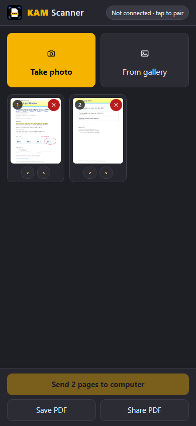
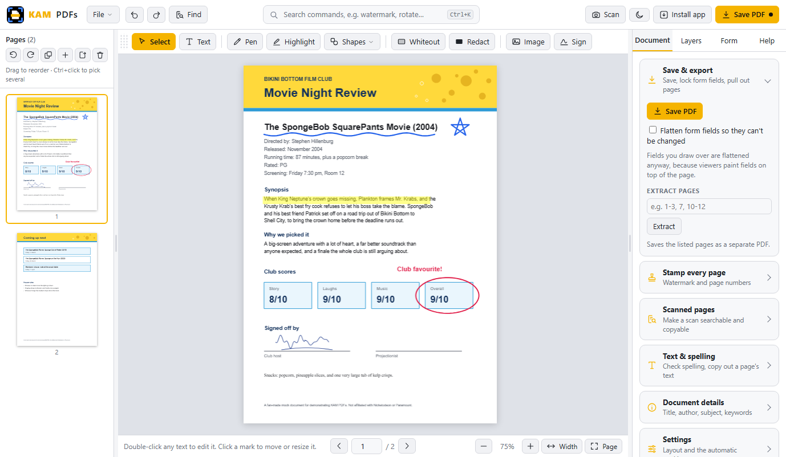

<p align="center">
  
</p>

<h1 align="center">KAM PDFs</h1>

<p align="center"><b>A free PDF editor and document scanner that just works. No account, no subscription, no upload. Runs on your computer, even offline.</b></p>

<p align="center">
  <a href="#download">Download</a> ·
  <a href="#what-it-does">Features</a> ·
  <a href="#scan-with-your-phone">Scanner</a> ·
  <a href="#screenshots">Screenshots</a> ·
  <a href="#how-it-works">How it works</a>
</p>



## Why this exists

You know the routine. You need to sign one form or fix one line in a PDF. You find an "editor", spend twenty minutes doing the work, hit Save, and only then does the paywall appear. Pay up, or lose everything you just did. Your document is held hostage, and half the time it has been uploaded to a server you have never heard of.

Scanner apps are the same story: point your phone at a letter and there is a subscription screen before the PDF. Straightening a photo and cleaning it up is not hard, and it is certainly not worth a monthly fee.

That is a scam dressed up as software, and I got sick of it. So I built KAM PDFs.

**KAM PDFs is free. Not free for seven days, not free with a watermark, not free until you click Save. Free.** There is no account, no upgrade button, no trial, and no upload. Your files never leave your computer. It works with the internet unplugged.

It stays that way. The code is MIT licensed, so it is yours to use, copy, and share with anyone. If someone ever tries to charge you for KAM PDFs, they are not me.

## Download

### Windows (recommended)

1. Download the latest zip from the [Releases page](../../releases/latest) and unzip it anywhere (for example `Documents\KAM PDFs`).
2. Double-click **`Install KAM PDFs.bat`**.
3. That's it. A **KAM PDFs** icon appears on your Desktop and in the Start Menu. It opens the editor in its own window, like any other app.

The installer only creates two shortcuts. To remove them, run `Remove shortcuts.bat`. Nothing else is written to your system.

If you have also installed KAM PDFs from the website (see below), the installer notices and points the shortcut at that instead, so you get the sharp taskbar icon and only one Desktop icon. Installed the app after running the installer? Just run it again.

> If Windows shows "Windows protected your PC", click **More info → Run anyway**. The script is a few lines of PowerShell you can read in `setup/install.ps1`.

### Install from the website (best icon, works offline too)

Open **https://ari-joon.github.io/KAM-PDFs/** in Chrome or Edge and click **⬇ Install app** in the top right (or the install icon in the address bar). You get a proper app with its own window, a sharp taskbar icon, and a Start Menu entry. The whole app is cached on your computer, so it keeps working with no internet.

### Mac, Linux, or no install

Unzip and open `index.html` in Chrome, Edge, Firefox, or Safari. Everything works the same. You can also use it straight from the browser at the link above.

## What it does

**Pages**
- Open, view, zoom, and jump between pages
- Rotate, delete, duplicate, and insert blank pages
- Reorder pages by dragging thumbnails
- Merge other PDFs into the current one
- Turn images (JPG, PNG, and so on) into PDF pages
- Extract a page range into a separate PDF (split)

**Annotate**
- Text in Helvetica, Times, or Courier, bold, any size and colour
- Freehand pen, lines, arrows, rectangles, ellipses
- Highlighter and whiteout
- Insert images and hand-drawn signatures
- Fixed-width text boxes that wrap automatically, or free-floating text
- Move, resize, recolour, and delete anything you added, with undo and redo
- Copy, paste, duplicate, and nudge annotations with the keyboard; paste images from the clipboard

**Scan**
- Use your phone as a scanner: photograph pages, they arrive on the computer straightened and cleaned up
- Auto-detects the page edges, with draggable corners to fix it when it guesses wrong
- Colour, grey, or black-and-white clean-up, rotation
- Works from the computer's webcam or from photos you already have
- The phone page also saves and shares PDFs on its own, no computer needed

**Document**
- Fill in form fields (text, checkboxes, radio buttons, dropdowns), optionally flatten them
- Watermark and page numbers on every page
- Edit title, author, subject, and keywords
- Extract the text of a page
- Export a page as a PNG
- Print
- Light and dark mode (the ☀ / 🌙 button, remembered between sessions)

## Screenshots

**Welcome screen.** Open a file, start a blank one, or scan a document.



**Pen and colours.** Freehand drawing with any colour and width.



**Signatures.** Draw once, place anywhere, resize.



**Scanning.** The Scan dialog on the computer and the scanner page on the phone.







**Light mode.** One click on the ☀ button, remembered between sessions.



## Scan with your phone

1. On the computer, click **📷 Scan**. A QR code and a 6-character code appear.
2. On your phone, point the camera at the QR code (or open the scanner page and type the code).
3. Tap **Take photo**, photograph a page, drag the corners if needed, pick Colour / Grey / B&W, tap **Add page**. Repeat for more pages.
4. Tap **Send to computer**. The pages appear in KAM PDFs as new pages. Annotate, sign, save.

The phone and computer talk to each other **directly** over an encrypted WebRTC connection. A small public relay (the PeerJS broker) is used only to introduce the two devices by that code; it never sees your pages. Both devices need internet for that first handshake, then the pages flow device to device.

No computer nearby? The phone page works on its own: scan, then **Save PDF** or **Share PDF**.

Phone scanner page: https://ari-joon.github.io/KAM-PDFs/scan.html

## Keyboard shortcuts

| Key | Action |
|---|---|
| `V` `T` `P` `H` | Select, Text, Pen, Highlight |
| `R` `E` `L` `A` `W` | Rectangle, Ellipse, Line, Arrow, Whiteout |
| `Del` | Delete the selected annotation |
| `Ctrl+Z` / `Ctrl+Y` | Undo / redo |
| `Ctrl+C` `Ctrl+V` `Ctrl+D` | Copy, paste, duplicate the selected annotation |
| Arrow keys | Nudge the selected annotation (Shift for 10x) |
| `Ctrl+S` / `Ctrl+P` | Save PDF / print |
| `←` `→` | Previous / next page (nothing selected) |
| `Ctrl` + mouse wheel | Zoom |

## How it works

KAM PDFs is plain HTML, CSS, and JavaScript. Rendering uses [pdf.js](https://mozilla.github.io/pdf.js/) (Mozilla) and editing uses [pdf-lib](https://pdf-lib.js.org/). Both are bundled in the `lib` folder, which is why it runs offline.

Annotations are kept on a layer over the page while you work and are drawn into the PDF itself when you save, so the result opens correctly in any PDF viewer.

```
index.html              layout and styles
core.js                 loading, rendering, navigation, undo, demo
annot.js                annotation tools and editing
ops.js                  page operations, forms, metadata, export
lib/                    pdf.js, pdf-lib, peerjs, qrcode (all bundled)
scan.html               phone scanner page
scan-core.js            edge detection, perspective correction, clean-up
scan-ui.js              corner editor widget (phone and desktop)
scan-desktop.js         Scan dialog, receives pages from the phone
sw.js                   service worker: offline cache, installable app
setup/install.ps1       creates the Desktop and Start Menu shortcuts
Install KAM PDFs.bat    double-click installer (Windows)
```

## Limits

- Password-protected PDFs can't be opened. Open them in another viewer and "Print to PDF" first.
- Existing text can't be edited in place. Cover it with whiteout and type over it.
- Whiteout is visual only. The original text is still inside the file, so don't rely on it for redacting sensitive information.

## Licence

MIT. See [LICENSE](LICENSE). pdf.js is Apache 2.0; pdf-lib, PeerJS, and qrcode.js are MIT.
