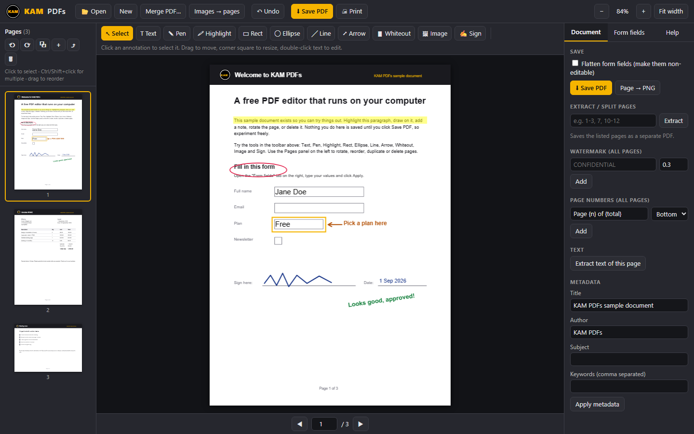
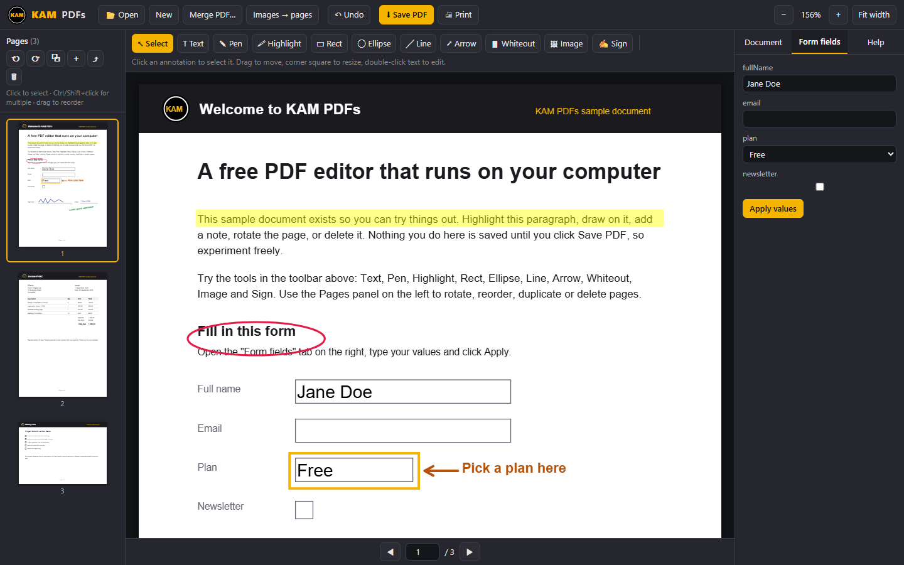
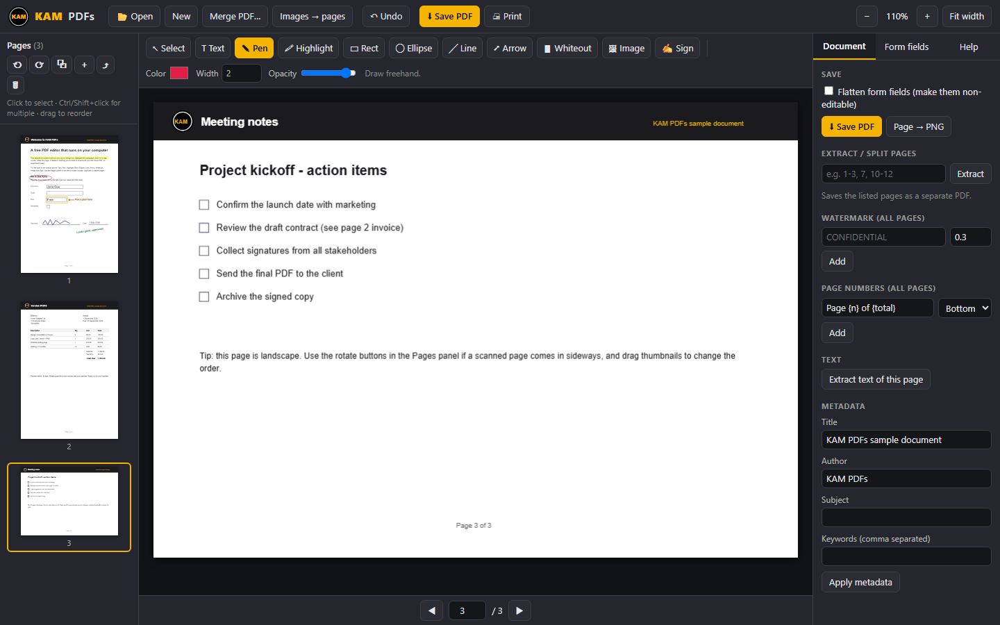

<p align="center">
  
</p>

<h1 align="center">KAM PDFs</h1>

<p align="center"><b>A free PDF editor that just works. No account, no subscription, no upload. Runs on your computer, even offline.</b></p>

<p align="center">
  <a href="#download">Download</a> ·
  <a href="#what-it-does">Features</a> ·
  <a href="#screenshots">Screenshots</a> ·
  <a href="#how-it-works">How it works</a>
</p>



## Why

Most PDF editors are paid, bloated, or want your files on their servers. KAM PDFs is a single folder you download and open. Your PDFs never leave your machine.

## Download

### Windows (recommended)

1. Download the latest zip from the [Releases page](../../releases/latest) and unzip it anywhere (for example `Documents\KAM PDFs`).
2. Double-click **`Install KAM PDFs.bat`**.
3. That's it. A **KAM PDFs** icon appears on your Desktop and in the Start Menu. It opens the editor in its own window, like any other app.

The installer only creates two shortcuts. To remove them, run `Remove shortcuts.bat`. Nothing else is written to your system.

> If Windows shows "Windows protected your PC", click **More info → Run anyway**. The script is a few lines of PowerShell you can read in `setup/install.ps1`.

### Mac, Linux, or no install

Unzip and open `index.html` in Chrome, Edge, Firefox, or Safari. Everything works the same. You can also use it straight from the browser at the GitHub Pages link at the top of this repo.

## What it does

**Pages**
- Open, view, zoom, and jump between pages
- Rotate, delete, duplicate, and insert blank pages
- Reorder pages by dragging thumbnails
- Merge other PDFs into the current one
- Turn images (JPG, PNG, and so on) into PDF pages
- Extract a page range into a separate PDF (split)

**Annotate**
- Text in Helvetica, Times, or Courier, bold, any size and colour
- Freehand pen, lines, arrows, rectangles, ellipses
- Highlighter and whiteout
- Insert images and hand-drawn signatures
- Move, resize, recolour, and delete anything you added, with undo

**Document**
- Fill in form fields (text, checkboxes, radio buttons, dropdowns), optionally flatten them
- Watermark and page numbers on every page
- Edit title, author, subject, and keywords
- Extract the text of a page
- Export a page as a PNG
- Print

## Screenshots

**Welcome screen.** Open a file, start blank, or load the built-in demo document.


**Form filling.** Fields are listed in the right-hand panel; type and click Apply.



**Pages and drawing.** Landscape pages, thumbnails you can drag to reorder, and the pen tool.



## Try it in 10 seconds

Click **Try the demo** on the welcome screen. It loads a three-page sample (a form, an invoice, and meeting notes) with a few annotations already placed, so you can move things around, add your own, and click **Save PDF** to see the result.

## Keyboard shortcuts

| Key | Action |
|---|---|
| `V` `T` `P` `H` | Select, Text, Pen, Highlight |
| `R` `E` `L` `A` `W` | Rectangle, Ellipse, Line, Arrow, Whiteout |
| `Del` | Delete the selected annotation |
| `Ctrl+Z` | Undo |
| `Ctrl+S` | Save PDF |
| `←` `→` | Previous / next page |
| `Ctrl` + mouse wheel | Zoom |

## How it works

KAM PDFs is plain HTML, CSS, and JavaScript. Rendering uses [pdf.js](https://mozilla.github.io/pdf.js/) (Mozilla) and editing uses [pdf-lib](https://pdf-lib.js.org/). Both are bundled in the `lib` folder, which is why it runs offline.

Annotations are kept on a layer over the page while you work and are drawn into the PDF itself when you save, so the result opens correctly in any PDF viewer.

```
index.html              layout and styles
core.js                 loading, rendering, navigation, undo, demo
annot.js                annotation tools and editing
ops.js                  page operations, forms, metadata, export
lib/                    pdf.js 3.11.174 and pdf-lib 1.17.1
examples/demo.pdf       the sample document
setup/install.ps1       creates the Desktop and Start Menu shortcuts
Install KAM PDFs.bat    double-click installer (Windows)
```

## Limits

- Password-protected PDFs can't be opened. Open them in another viewer and "Print to PDF" first.
- Existing text can't be edited in place. Cover it with whiteout and type over it.
- Whiteout is visual only. The original text is still inside the file, so don't rely on it for redacting sensitive information.

## Licence

MIT. See [LICENSE](LICENSE). pdf.js is Apache 2.0 and pdf-lib is MIT.
